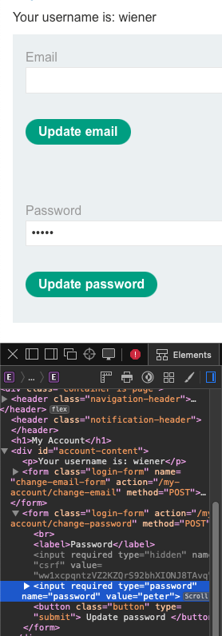
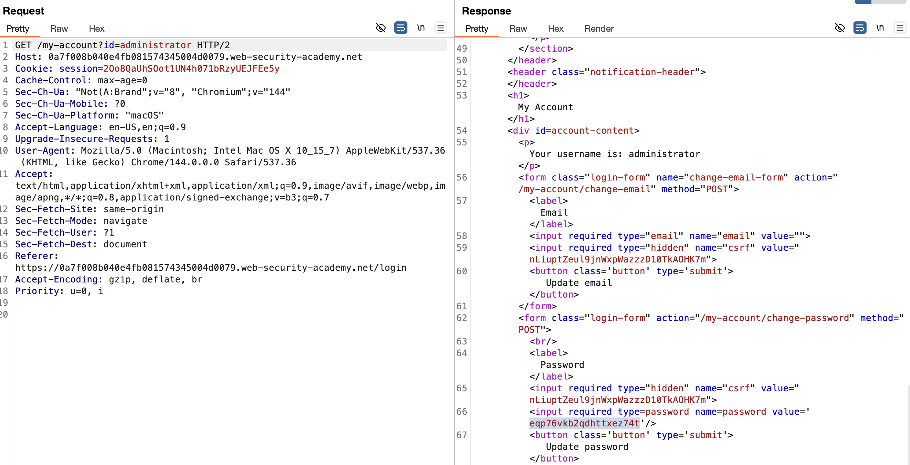
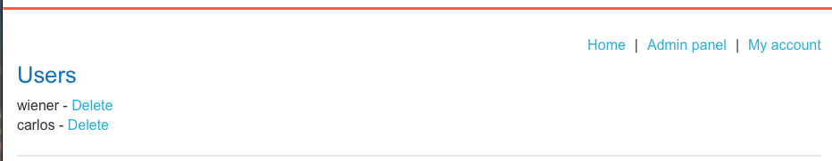

# User ID controlled by request parameter with password disclosure
## Vulnerability Breakdown
The application suffers from an Insecure Direct Object Reference (IDOR) vulnerability within
the user account management functionality. The system relies on a user-supplied request parameter 
(id) to determine which user's account page to display. Because the application fails to validate 
if the requesting user has the authorization to view the target profile, an attacker can access 
sensitive information belonging to any user, including administrative accounts.

## Technical Analysis
The vulnerability is located in the account profile endpoint. When a user views their account, 
the application makes a GET request structured as follows:  

<i>GET /my-account?id=wiener</i>

Beyond the IDOR, the application exhibits a critical Information Disclosure flaw. In the HTML 
response for the account page, the user's password is not just masked in the UI, but is actually 
included as a plaintext value within the value attribute of an input field in the source code.  

As seen in the technical notes, the password peter for the user wiener is visible in the page's 
DOM via the browser's Inspect tool:  

```<input required type="password" name="password" value="peter">```



## Exploitation Steps
To demonstrate the impact of this vulnerability, we can escalate privileges by capturing the 
administrator's credentials.  
1. Intercept Traffic: Connect the browser to Burp Suite and log in with standard user credentials (e.g., <i>wiener:peter</i>).
2. Identify Parameter: Navigate to "My Account" and observe the URL structure: <i>/my-account?id=wiener</i>.
3. Manipulate Request: Send the request to Burp Repeater. Change the <i>id</i> parameter from <i>wiener</i> to <i>administrator</i> and send the request.
4. Extract Sensitive Data: Review the HTTP response. Search the HTML source for the password input field.
     * Discovered Administrator Password: <i>eqp76vkb2qdhttxez74t</i>.

5. Full Compromise: Use the extracted credentials to log in as the <i>administrator</i>, access the Admin Panel, and perform restricted actions such as deleting user accounts (e.g., deleting the user <i>carlos</i>)


## Security Impact
* <b>Confidentiality:</b> High. Plaintext passwords and sensitive user data are exposed to any authenticated user.
* <b>Integrity:</b> High. An attacker can gain administrative access, allowing them to modify or delete user data across the entire platform.
* <b>Account Takeover:</b> The exposure of the actual password allows for permanent account takeover, even if the user changes their session or email.

## Remediation Recommendations
To mitigate these risks, the following security controls should be implemented:  
* <b>Implement Proper Access Control:</b> Instead of relying on a client-side id parameter, the application should identify the user based on their session token stored securely on the server side.
* <b>Remove Sensitive Data from Responses:</b> Never include passwords or other highly sensitive credentials in the HTML source code, even if they are "hidden" or "masked" in the UI. The password field should remain empty unless the user is actively typing a new one.


