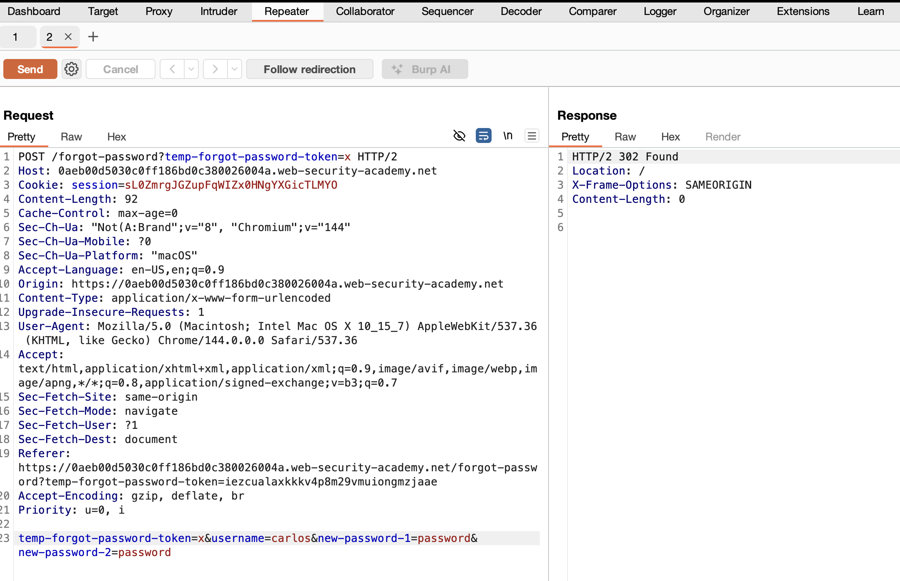

# Password Reset Broken Logic
This writeup details the exploitation of a broken authentication mechanism in a password reset function. 
By analyzing the logic of the reset request, it was possible to bypass token validation and reset the 
password for an arbitrary user account.

## Vulnerability Breakdown
The application suffers from Broken Authentication Logic within its password reset functionality. 
Specifically, the server fails to verify if the <i>temp-forgot-password-token</i> provided in the POST request 
is valid or if it is cryptographically linked to the user account being modified. This allows an attacker 
to manipulate the username parameter and reset any user's password using a dummy or arbitrary token value.

## Technical Analysis
When a user resets their password, the application sends a POST request to /forgot-password. 
This request typically includes the following parameters in the body:
* <b>temp-forgot-password-token:</b> A unique string meant to authorize the reset.
* <b>username:</b> The account for which the password will be changed.
* <b>resetted password:</b> The new credentials.

The flaw exists because the backend processing logic treats the presence of any token as sufficient 
for the request to proceed, without confirming that the token belongs to the specific username submitted 
in the same request.

## Exploitation Steps
1. Capture the Reset Request  
Initiate a password reset for a controlled account (e.g., wiener). Capture the final submission request
(where the new password is set) using Burp Suite and send it to the Repeater tab.
2. Identify and Modify Parameters  
In the Burp Repeater tab, modify the captured request as follows:
* <b>Token Bypass:</b> Change the temp-forgot-password-token value in both the URL query string and the POST body to an arbitrary value, such as x.
* <b>Target Selection:</b> Change the username parameter from the controlled account (wiener) to the victim account (e.g., carlos).
* <b>Credential Setting:</b> Enter a new password of your choice in the password fields.
3. Execute the Bypass  
Click <b>Send</b>. The server responds with a 302 Found, indicating the password change was accepted despite the invalid token.
  
4. Verify Account Takeover  
Navigate to the login page and use the victim's username (carlos) and the newly set password to log in successfully.

## Security Impact
* <b>Complete Account Takeover:</b> An attacker can reset the password of any user, including administrative accounts, without needing access to the victim's email.
* <b>Data Breach:</b> Unauthorized access to accounts can lead to the exposure of sensitive user data, such as email addresses and internal account details.
* <b>Loss of Integrity:</b> Attackers can modify user profiles or perform actions on behalf of the victim.

## Remediation Recommendation
* <b>Strict Token Validation:</b> The server must verify that the <i>temp-forgot-password-token</i> is both valid (unexpired and unused) and cryptographically bound to the specific username requesting the reset.
* <b>Use Vague Error Messages:</b> Ensure that any errors during the authentication or reset process do not disclose which part of the credentials (username vs. password) was incorrect.
* <b>Rate Limiting:</b> Implement IP-based blocking or account lockouts after a certain number of failed attempts to prevent automated exploitation.

