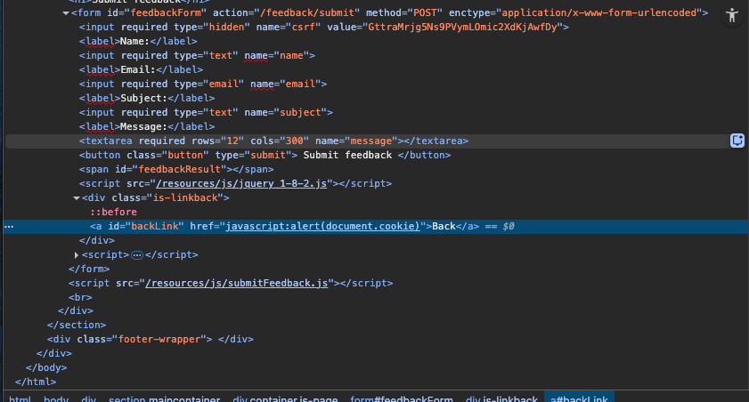
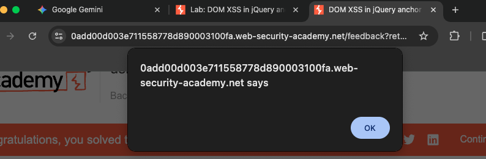

# DOM XSS in jQuery anchor href attribute sink using location.search source
This lab demonstrates a DOM-based Cross-Site Scripting (XSS) vulnerability. The application insecurely handles user-controlled input from the URL (location.search) and passes it into a dangerous sink (jQuery’s .attr() method). This allows an attacker to execute arbitrary JavaScript in the victim's browser context by manipulating the returnPath parameter.

## Vulnerability Breakdown
* <b>Source:</b> location.search (returnPath query parameter)
* <b>Sink:</b> jQuery .attr("href", ...)
* <b>Vulnerability Type:</b> DOM-based XSS

## Technical Analysis
While inspecting the "Submit Feedback" page, I identified a "Back" link with the following implementation: 

<b>HTML Structure:</b>
```
<a id="backLink" href="/">Back</a>
```
<b>Vulnerable JavaScript Snippet:</b>
```
$(function() {
    $('#backLink').attr("href", (new URLSearchParams(window.location.search)).get('returnPath'));
});
```
The script uses URLSearchParams to extract the value of the returnPath key from the URL and directly assigns it to the href attribute of the #backLink element without any sanitization.

## Exploitation Steps
1. <b>Identify Reflection:</b> By entering a random string like test in the URL (e.g., ?returnPath=test), I observed that the "Back" link's href changed to test.
2. <b>Payload Selection:</b> To execute JavaScript within an <a> tag's href attribute, the 'javascript:' pseudo-protocol can be used.
3. <b>Final Payload</b>
    * URL: https://[lab-id].web-security-academy.net/feedback?returnPath=javascript:alert(document.cookie)
4. <b>Executation:</b> After navigating to the crafted URL and clicking the "Back" link, the alert(document.cookie) executed successfully, proving the vulnerability.



## Security Impact
* Get unauthorized access by stealing session cookies -> act on user's behalf
* Use phishing to redirect users to malicious external websites

## Remediation Recommediations
* Input validation (e.g., list of allowed paths)
