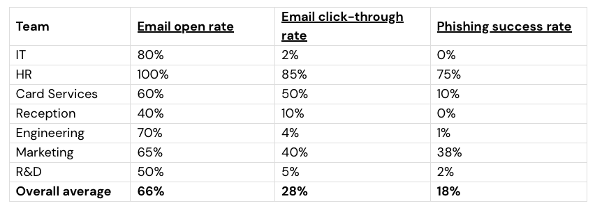

# Mastercard Security Awareness: Phishing Simulation and Training
This project demonstrates the end-to-end process of executing a phishing simulation, analyzing departmental risk, and developing targeted security awareness training.

## Phishing Campaign Optimzation
I analyzed an initial "urgent" phishing email and developed an improved, more sophisticated version to test employee vigilance against modern social engineering tactics.

### Original Phishing Email
From: mastercardsIT@gmail.com  
To: employee@email.com  
Subject: URGENT!  Password Reset Required—  

Hello (insert name),
Your email account has been compromised.  immediate action is required to reset your password!
Click here to reset your password in the next hour or your account will be locked: [https://en.wikipedia.org/wiki/Phishing](https://en.wikipedia.org/wiki/Phishing)  
Regards,  
Mastercard IT

### Improved Phishing Email
From: Mastercard Global IT Support  
To: [Employee Name]  
Subject: Action Required: Mandatory Security Protocol Update for Remote Access

Hello [Employee Name],  
As part of our ongoing commitment to the Mastercard Secure-Work Initiative, we are currently updating the multi-factor authentication (MFA) requirements for all employees accessing corporate systems remotely.  

To ensure your workstation remains complaint with the new security policy and to avoid any interruption in our service, please synchronize your credentials with the updated portal by the end of the business day.  
Failure to complete this synchronization may result in a temporary lockout form the internal network and require a manual reset via the IT Help Desk.  

Please follow the link below to complete the update: [Mastercard SSO Authentication Portal](#)

Thank you for your cooperation,  
Mastercard Global IT Infrastructure Team.  
*CONFIDENTIAL: Any files transmitted with it are confidential and intended solely for the use of the individual or entity to whom they are addressed.*

### Improvements Made
* **Professional Branding:** Updated the sender to "Mastercard Global IT Support" and added a confidentiality disclaimer to mimic official corporate communication.
* **Contextual Urgency:** Replaced generic "account locked" threats with a "Mandatory Security Protocol Update," a common tactic used to bypass suspicion.
* **Link Masking:** Used descriptive plaintext (e.g., "Mastercard SSO Authentication Portal") to hide the destination URL.
* **Legitimacy Add-Ons:** Confidentiality disclaimer, correct grammar and spelling, and personalization.

## Data Analysis and Risk Assessment
After the simulation, I analyzed departmental performance to identify where training was most critical.  

**Findings:**
* High-Risk Departments: HR and Marketing were the most susceptible, with HR showing a staggering 75% success rate for the attack.
* The "Curiosity Gap": Departments dealing with external communications (HR/Marketing) are naturally more inclined to open attachments and links, making them primary targets.

## Targeted Security Training
I developed a ["Phishing 101"](Security-Awareness-Phishing.pptx) training module specifically for the HR and Marketing teams, focusing on the tactics most likely to deceive them.  
Training Summary:
* **The False Alarm:** Educating users on how extreme urgency is used to induce panic.
* **The Brand Mimic:** Training employees to spot slightly altered URLs (e.g., micr0ft.com).
* **Defensive Playbook:** Providing actionable steps for reporting suspicious activity.
